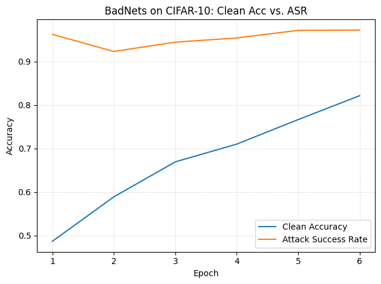
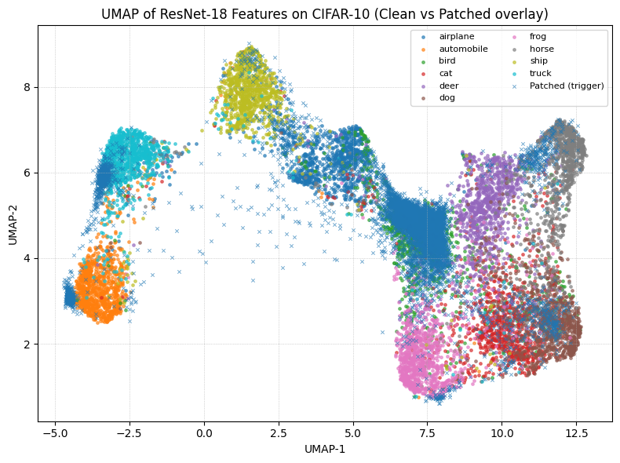
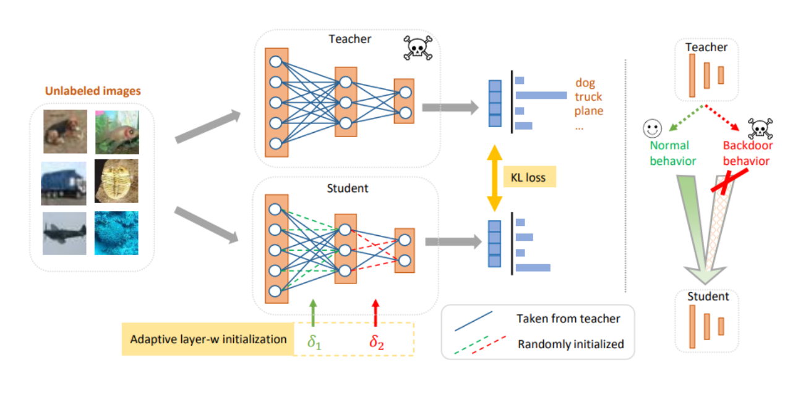

# Backdoor Attack (BadNets) and Cleansing Defense

This repository demonstrates the vulnerability of Deep Neural Networks to backdoor attacks and implements a state-of-the-art defense mechanism to cleanse the model using only unlabeled data.

## Overview

### Part 1: BadNets Backdoor Attack
We trained a **ResNet-18** model on the **CIFAR-10** dataset[cite: 94, 113]. A backdoor was injected using the **BadNets** approach by adding a specific trigger (patch) to a subset of the training images and altering their labels to a target class[cite: 94, 113].
*   The poisoned model achieved an **83.03% Clean Accuracy** and a highly successful **97.75% Attack Success Rate (ASR)**[cite: 94].
*   We visualized the latent space using **UMAP**, demonstrating how the patched data points are artificially clustered towards the target class[cite: 97, 113].

### Part 2: Backdoor Cleansing (Defense)
To recover a clean model without accessing the original labeled dataset or knowing the trigger, we applied **Backdoor Cleansing with Unlabeled Data** (Pang et al., 2023)[cite: 116].
*   **Adaptive Layer-wise Initialization:** The student model's weights were initialized from the backdoored teacher model adaptively ($\delta=0.1$ for early layers, $\delta=0.5$ for middle, $\delta=0.8$ for deep layers) to retain basic feature extractors while resetting potentially malicious deep patterns[cite: 98, 114, 115].
*   **Knowledge Distillation:** We trained the student model using unlabeled data and the teacher's outputs[cite: 99, 115]. We compared **Cross Entropy (CE)** and **KL Divergence** loss functions[cite: 99].
*   **Results:** The CE loss outperformed KL Divergence, successfully dropping the ASR to **9.72%** while maintaining a solid Clean Accuracy of **82.93%**[cite: 99, 100].

---

## Sample Outputs

### Attack Performance (Clean Acc vs. ASR)
The progression of Clean Accuracy and Attack Success Rate during the 10 training epochs of the poisoned model:
<br>


### UMAP Latent Space Visualization
The feature representation of the ResNet-18 model. The patched samples (trigger) are clearly driven toward the target class, breaking the natural class boundaries:
<br>


### Defense Architecture
The adaptive layer-wise initialization and knowledge distillation process:
<br>


---

## Installation & Usage

1. Clone the repository:
```bash
git clone [https://github.com/yourusername/backdoor-attack-and-defense.git](https://github.com/yourusername/backdoor-attack-and-defense.git)
cd backdoor-attack-and-defense
